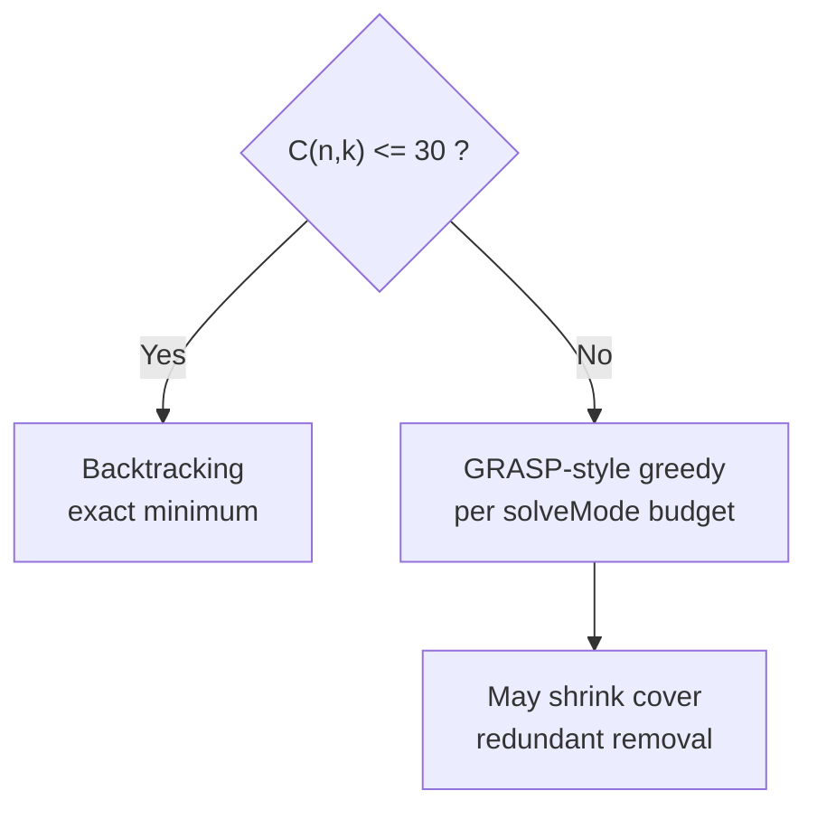

# Optipick

**Optimal sample subset picker** for a fixed course formulation: draw **n** distinct IDs from **1…m**, then minimize how many **k**-groups you need so every **j**-subset of those samples meets coverage rules (**s**, **at least**) — modeled as set cover.

**[Live demo](https://optipick-system.vercel.app)** · [Local (offline) mode](./docs/local-mode.md) · [Deploy to Vercel](./docs/vercel-deployment-guide.md) · [Docs index](./docs/README.md)

Algorithm deep dive: [Algorithm implementation detail](./docs/algorithm-implementation-detail.md)

---

## Overview

Subsampling should stay **fair and rule-driven**. This repository ships a **web UI** (hosted or local), a tiny **HTTP API** for the same UI when run locally, and a **CLI** for scripts. The solver is **plain Node** in this repo (no separate “algorithm SaaS”).

---

## Features

- Hosted UI on **Vercel** — open the browser, no `git clone`.
- **Local** UI + API — `npm run local:web`; solving runs on your machine (`cli/src/algorithm.js`), good for flaky or offline use after install.
- **CLI** — `node cli/index.js solve …` with JSON output and optional `--save` to a **local file DB** (`~/.optimal-samples-selector/db/`).
- **Verify Candidate** — checks whether returned or pasted groups really cover all required `j`-combinations.
- **Solve modes** — `fast`, `balanced`, and `quality` trade off runtime and result quality for large cases.
- **Regression tests** — `npm test` covers exact solving, verification failures, forged precomputed saves, and local DB filename validation.
- Optional **Supabase** on the hosted deployment for cloud history (env-gated); without it, Execute still works; cloud DB routes need configuration.

---

## Repository layout

```
optimal-samples-selector/
├── api/            # Vercel serverless APIs and shared solver/verification logic
├── cli/            # Local static server, Commander CLI, and local wrappers
├── database/       # Optional Supabase setup SQL
├── docs/           # Public project, algorithm, deployment, and usage docs
├── scripts/        # Utility scripts for evidence/report generation
├── test/           # Node.js regression tests
├── web-ui/         # Static frontend
├── package.json    # npm run local:web | local:solve | test
└── vercel.json     # Vercel routing/build configuration
```

---

## Installation

From the repository root (needed for **local web** and **CLI**):

```bash
npm install
cd cli && npm install && cd ..
```

---

## Usage

Pick **one** column that matches how you want to work.

| | Hosted | Local web | CLI |
|---|--------|-----------|-----|
| **You need** | Network | `npm install` once | `npm install` once |
| **Solver runs on** | Vercel (Node) | Your machine | Your machine |
| **Typical entry** | Open [Live demo](https://optipick-system.vercel.app) | `npm run local:web` then `http://localhost:3000` | `cd cli && node index.js solve …` |

### Hosted

Use when you are online and do not want a checkout. The UI calls **`POST /api/solve`** on the same host (Vercel). **Cloud History** on that deployment only works if **Supabase** env vars are set; otherwise use copy/export from the UI or run **local web** for a file DB.

### Local web

Solving does **not** call Vercel or Supabase. History goes under `~/.optimal-samples-selector/db/` (see [local-mode](./docs/local-mode.md)).

```bash
npm run local:web                 # http://localhost:3000
node cli/index.js web -p 3001     # alternate port
```

The HTML loads **Google Fonts** from Google’s CDN (typography only).

### CLI

```bash
cd cli
node index.js solve -m 45 -n 8 -k 6 -j 6 -s 5
node index.js solve ... --samples "1,2,3,4,5,6,7,8"
node index.js solve ... --at-least 4
node index.js solve ... --solve-mode fast
node index.js solve ... --save
node index.js list | show -f <name> | delete -f <name>
```

### Verify

The UI includes a **Verify Candidate** action. It sends selected samples and candidate groups to **`POST /api/verify`**, then reports:

- whether all required `j`-combinations are covered
- covered/total count and percentage
- first failed combinations when verification fails

Saved precomputed results are also verified before persistence, so invalid pasted/forged groups cannot be stored as trusted history records.

---

## Network & third parties

| Surface | Internet for solving? | Calls |
|---------|------------------------|--------|
| Hosted UI | Yes (page + each solve/verify) | **Vercel**; optional **Supabase** if configured |
| Local web | No (after install) | Localhost only for `/api/solve`, `/api/verify`, and file DB |
| CLI | No | Local only |

Core logic lives in **`api/algorithm.js`** (Vercel) and **`cli/src/algorithm.js`** (local, re-exporting the API algorithm). Verification logic lives in **`api/verify-core.js`** and is reused by the API, local web server, and tests. Aside from **Vercel** hosting, optional **Supabase** persistence, and **Google Fonts**, there are no other backends for the solve path.

---

## Parameters

`m` ∈ [45, 54] · `n` ∈ [7, 25] · `k` ∈ [4, 7] · `s` ∈ [3, 7] · `s ≤ j ≤ k` · `n ≤ m` · `k ≤ n` · manual samples: **n** distinct integers in `[1, m]`.

---

## Algorithm

### Figures

Pipeline in one sentence: pick **n** → every **k**-subset of those samples is a candidate → each **j**-subset of the **n** samples is a constraint → choose **fewest** candidates that jointly satisfy the rules.




### Model

After fixing **n** sample IDs from **m**, enumerate every candidate **k**-subset of those **n** samples. Each candidate **covers** a set of **j**-subset constraints according to **s** and **at least** (see `api/algorithm.js`, `coversRequirement`). Minimize the number of chosen candidates — a **set cover** instance.

### Exact mode

If `C(n,k) ≤ 30`, the solver uses **backtracking** on coverage-deduplicated candidates, seeded with a greedy upper bound, ordered by how many uncovered **j**-constraints each candidate hits, with simple lower-bound pruning. Intended for very small combinatorial spaces only, so hosted solves do not time out.

### Heuristic mode

If `C(n,k) > 30`, a **time-bounded GRASP-style** greedy (`greedySetCover`) runs with per-`solveMode` wall clocks (`fast` ≈ 2.2s, `balanced` ≈ 3.5s, `quality` ≈ 5.5s in the GRASP phase). A **fast path** exists when `solveMode === fast`, `j === k`, `s === k - 1`, `atLeast === 1`, and `C(n,k) ≥ 5000` (`fastRadiusCoverHeuristic`). **Redundant-group removal** may run afterward when `C(n,k)` is below internal cost thresholds.

GRASP does **not** certify a global optimum; use the exact branch when `C(n,k) ≤ 30` if you need a certified minimum under this codebase’s rules.

---

## Data

- **Local:** `~/.optimal-samples-selector/db/`, filenames `m-n-k-j-s-x-y`; JSON includes `atLeast`, `solveMode`, `method`, samples, groups, timestamp.
- **Cloud:** Supabase when env vars are set on Vercel; otherwise cloud save is off.

---

## Tests

```bash
npm test
```

The current regression suite checks:

- exact small-case result quality
- candidate verification pass/fail behavior
- rejection of malformed/injection-like group values
- rejection of forged precomputed saves before persistence
- local DB filename validation
