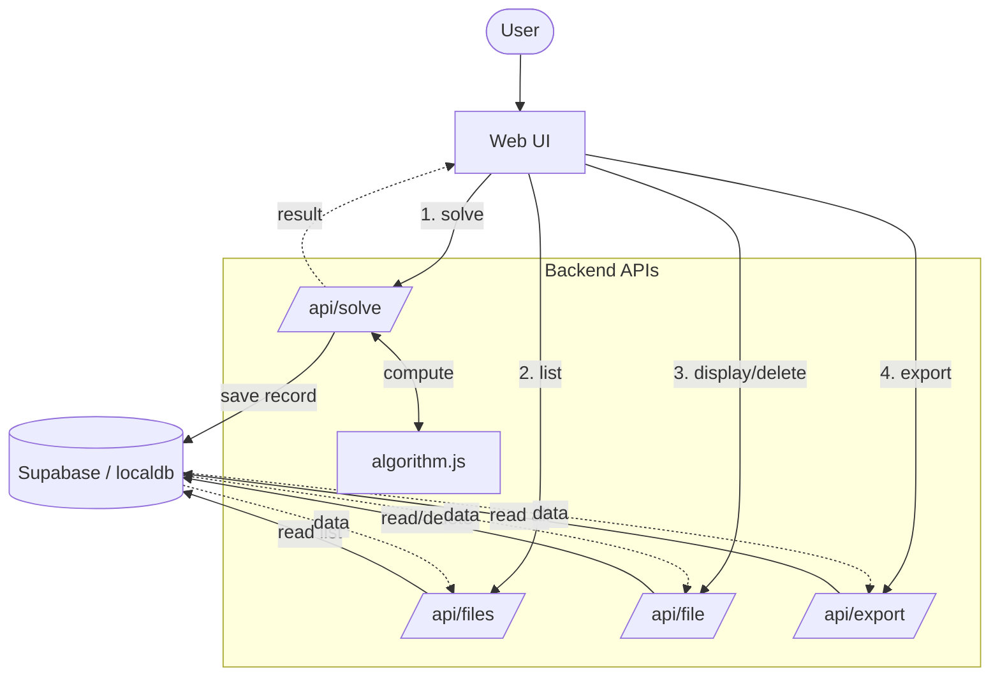
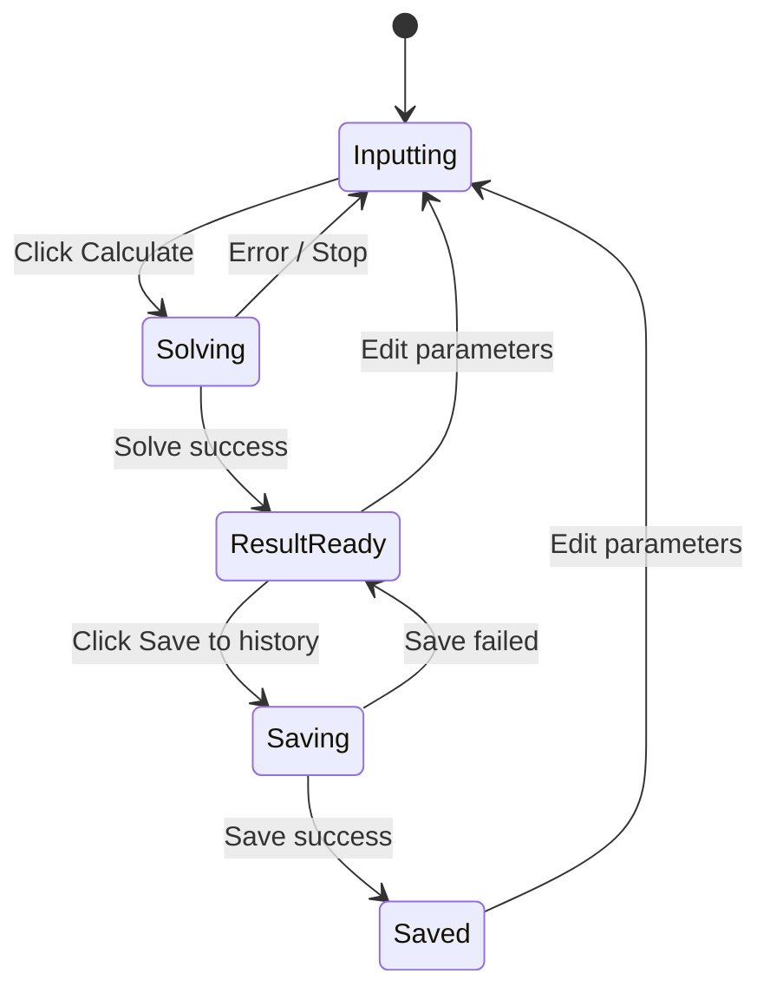
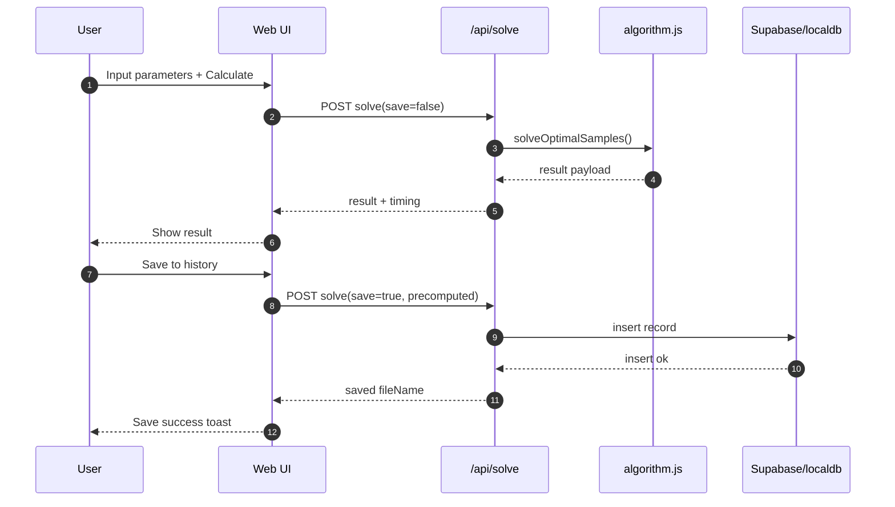

# Project Report

## Cover Page

- Group Number: `<fill>`
- Course: `CS360/SE360 D1 Artificial Intelligence`
- Project: `An Optimal Samples Selection System`
- Member 1: `陈鸿天 / 1230002551`
- Member 2: `陈乐怡 / <student id>`
- Member 3: `冯宏臻 / <student id>`
- Member 4: `余升斌/ <student id>`
- Date: `2026.4.28`

---

## 1. Introduction

This project implements an optimal samples selection system based on set-cover style modeling.
The goal is to choose as few `k`-groups as possible while satisfying coverage constraints defined by `j`, `s`, and `at least`.

Problem context:

- Total data scale is large (`m`)
- We select `n` samples from `m`
- We then find minimal groups of size `k` to satisfy required coverage

---

## 2. Problem Definition

Input parameters:

- `m`: total samples (`45 <= m <= 54`)
- `n`: selected samples (`7 <= n <= 25`)
- `k`: group size (`4 <= k <= 7`)
- `j`: constrained by `s <= j <= k`
- `s`: subset size (`3 <= s <= 7`)
- `at least`: minimum required covered `s`-combinations (default = 1)

Target:

- Minimize number of selected `k`-groups
- Ensure each required `j`-combination satisfies coverage rule

---

## 3. Methodology

### 3.1 Core model

We model the task as a set cover optimization problem:

- Universe: all required `j`-combinations
- Candidate sets: each possible `k`-group and the `j`-combinations it covers
- Objective: choose minimum candidate sets that cover universe

### 3.2 Algorithms used

1. **Exact method (Backtracking)**
   - Used when search space `C(n,k)` is small
   - Includes pruning and bounds
   - Provides optimal solution

2. **Approximate method (GRASP / GRASP-fast)**
   - Used when search space is large
   - Time-bounded and practical
   - Produces near-optimal solution

### 3.3 Engineering optimizations

- Coverage precomputation
- Bitset acceleration for coverage counting
- Equivalent-group deduplication
- Redundant-group removal post-processing

### 3.4 Methodology diagrams and simple example

#### (A) Program flowchart (solver pipeline)

```mermaid
flowchart TD
  A([Start solve request]) --> B[Validate parameters]
  B -->|Invalid| E([Return error])
  B -->|Valid| C[Build search space & indexes]
  C --> D{C(n,k) <= threshold?}
  
  D -->|Yes| F[Run backtracking exact solver]
  
  D -->|No| G{solveMode}
  subgraph GRASP Heuristics
    G -->|fast| H[GRASP-fast]
    G -->|balanced| I[GRASP medium budget]
    G -->|quality| J[GRASP larger budget]
  end
  
  F --> K[Build result payload]
  H --> K
  I --> K
  J --> K
  
  K --> L{save=true?}
  L -->|Yes| M[(Persist to DB)]
  M --> N([Return result])
  L -->|No| N
```

#### (B) Simple example (small exact case)

Example input:

- `m=45, n=8, k=6, j=6, s=5, at least=1`

Reasoning:

- `C(n,k)=C(8,6)=28`, search space is small.
- System selects **backtracking exact** method.
- Output is globally optimal for this case.

---

## 4. System Design

### 4.1 Architecture

- Frontend: single-page web UI
- Backend API: compute + DB operations
- Database: Supabase `results` table (cloud) or localdb (offline mode)

### 4.2 Main modules

- `api/algorithm.js`: core solving logic
- `api/solve.js`: compute endpoint + validation + save
- `api/files.js`: list saved files
- `api/file.js`: display/delete one saved file
- `api/export.js`: export DB records to JSON
- `web-ui/index.html`: UI for calculation and history management

### 4.3 Data format

Stored record naming:

`m-n-k-j-s-x-y`

- `x`: run count
- `y`: result group count

### 4.4 System flowchart



### 4.5 UI state diagram



### 4.6 API sequence diagram



---

## 5. Features Implemented

- User-friendly web UI with parameter form
- Two input modes: random/manual
- Validation for legal input ranges and relationships
- Solve and show result groups
- Save/display/delete DB records
- Print result support
- Export DB records as JSON for submission package

---

## 6. Experiments and Sample Runs

### 6.1 Test setting

Use representative cases from project examples.

Case A:

- `m=45, n=8, k=6, j=6, s=5, at least=1`

Case B:

- `m=50, n=20, k=6, j=6, s=5, at least=1`

Case C:

- `m=50, n=25, k=6, j=6, s=5, at least=1`

### 6.2 Results summary

| Case | Parameters | Method | Group Count | Runtime | Note |
|---|---|---|---:|---:|---|
| A | 45,8,6,6,5,1 | backtrack (exact) | 4 | ~4002 ms | 5 runs, 100% coverage (28/28) |
| B | 50,20,6,6,5,1 | grasp (balanced) | 1104 | 5069 ms | 100% coverage (38760/38760) |
| C | 50,25,6,6,5,1 | grasp-fast | 5632 | 238 ms | speed-priority mode, 100% coverage (177100/177100) |

Add screenshots in appendix and place raw outputs in `submission/sample-runs/`.

### 6.3 Correctness and evidence

To avoid only reporting "pass/fail", we provide reproducible evidence files:

- Script: `scripts/generate-evidence-report.js`
- Output folder: `submission/sample-runs/`
- Evidence includes:
  - covered/total `j`-combinations and coverage percentage
  - method used (`backtrack`, `grasp`, `grasp-fast`, `grasp-quality`)
  - runtime and group-count statistics
  - best-run selected groups

Representative evidence files:

- `submission/sample-runs/evidence-2026-04-14T06-15-31-460Z.md`
- `submission/sample-runs/evidence-n20-fast.md`
- `submission/sample-runs/evidence-n25-fast.md`

Interpretation:

- `backtrack` on small spaces gives exact optimum.
- `grasp` / `grasp-quality` provides near-optimal results under time budget.
- `grasp-fast` is speed-priority mode for very large inputs.

---

## 7. Contributions and Improvements

- Built complete end-to-end system (UI + API + DB)
- Added strict backend validation to prevent invalid demo inputs
- Added DB export for reproducible submission evidence
- Organized final submission package structure

---

## 8. Limitations

- Exact method is expensive for large search spaces
- GRASP-based heuristics are approximate and may not always be globally optimal
- Runtime still depends on parameter combination complexity

---

## 9. Future Work

- Better approximation strategies for larger cases
- More advanced pruning / branch-and-bound improvements
- Mobile-focused UI and offline support

---

## 10. Conclusion

The project successfully implements the required optimal samples selection workflow.
It satisfies core functional requirements and supports practical submission needs (history management, evidence export, and structured delivery package).

---

## Appendix A - Installation and Execution Snapshot

Refer to `User-Manual.md` for full steps.

---

## Appendix B - Submission Mapping

- Source code: `submission/source-code/`
- DB setup + exports: `submission/db/`
- Sample runs: `submission/sample-runs/`
- User Manual PDF: `submission/reports/User-Manual.pdf`
- Project Report PDF: `submission/reports/Project-Report.pdf`
- Slides: `submission/presentation/`

