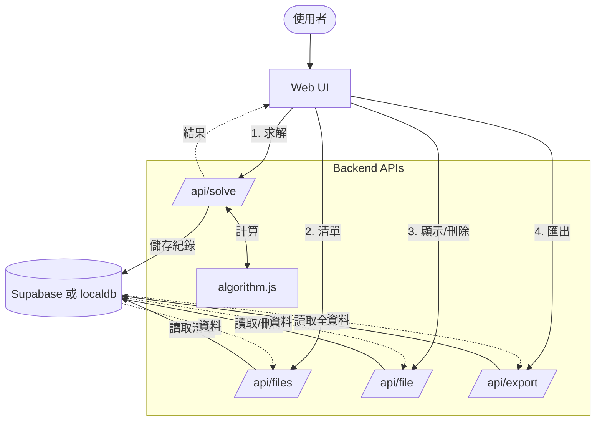
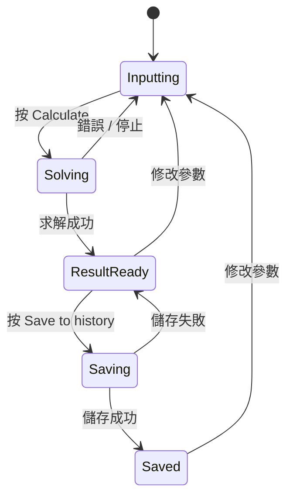
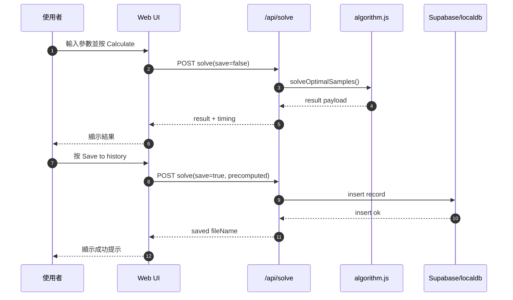

# 專題報告（Project Report）


## 封面資訊

- 組號：`<fill>`
- 科目：`CS360/SE360 D1 Artificial Intelligence`
- 專題：`An Optimal Samples Selection System`
- 組員 1：`陳鴻天 / 1230002551`
- 組員 2：`陳樂怡 / <student id>`
- 組員 3：`馮宏臻 / <student id>`
- 組員 4：`余昇斌 / <student id>`
- 日期：`2026.4.28`

---

## 1. 緒論

本專題實作一套以「集合覆蓋」風格建模的最優樣本選擇系統。目標是在滿足由 `j`、`s` 與「至少（at least）」所定義的覆蓋條件下，盡可能少用大小為 `k` 的樣本組。

問題背景：

- 母體規模很大（`m`）
- 從 `m` 中選出 `n` 個樣本
- 再找出數量最少的 `k` 人（物）一組，使覆蓋條件成立

---

## 2. 問題定義

輸入參數：

- `m`：總樣本數（`45 <= m <= 54`）
- `n`：選出的樣本數（`7 <= n <= 25`）
- `k`：每組大小（`4 <= k <= 7`）
- `j`：須滿足 `s <= j <= k`
- `s`：子集合大小（`3 <= s <= 7`）
- `at least`：每個 `j` 組合下，至少須被覆蓋的 `s` 組合個數（預設 = 1）

目標：

- 最小化所選 `k` 組的數量
- 使每個要求的 `j` 組合皆滿足覆蓋規則

---

## 3. 方法論

### 3.1 核心模型

將任務建模為集合覆蓋（Set Cover）最佳化：

- 全集：所有須被覆蓋的 `j` 組合
- 候選集合：每個可能的 `k` 組，以及其能覆蓋的 `j` 組合
- 目標：選出最少個候選集合，覆蓋整個全集

### 3.2 所採用演算法

1. **精確法（回溯 Backtracking）**
   - 當搜尋空間 `C(n,k)` 較小時使用
   - 含剪枝與上下界
   - 可得到最佳解

2. **近似法（限時 GRASP）**
   - 當搜尋空間較大時使用（以時間預算內多輪隨機化貪心迭代，改善單次貪心易陷入局部最佳的問題）
   - 速度快、可於雲端函式時限內穩定回傳
   - 產生接近最佳的實務解（不保證全域最佳）

### 3.3 工程層面最佳化

- 覆蓋關係預先計算
- 以位元集合（bitset）加速覆蓋計數
- 依覆蓋模式之等價類去重（減少冗餘候選）
- 解出後之冗餘組移除（後處理）

### 3.4 方法流程圖與小型範例

#### (A) 程式流程圖（求解管線）

```mermaid
flowchart TD
  A([開始求解請求]) --> B[驗證參數]
  B -->|不合法| E([回傳錯誤])
  B -->|合法| C[建立搜尋空間與索引]
  C --> D{C(n,k) <= 門檻?}
  
  D -->|是| F[執行回溯精確解]
  
  D -->|否| G{solveMode}
  subgraph GRASP Heuristics
    G -->|fast| H[執行 GRASP-fast]
    G -->|balanced| I[執行 GRASP（中等預算）]
    G -->|quality| J[執行 GRASP（較高預算）]
  end
  
  F --> K[組裝結果資料]
  H --> K
  I --> K
  J --> K
  
  K --> L{save=true?}
  L -->|是| M[(寫入 DB/localdb)]
  M --> N([回傳結果])
  L -->|否| N
```

#### (B) 小型範例（精確法）

範例輸入：

- `m=45, n=8, k=6, j=6, s=5, at least=1`

說明：

- `C(8,6)=28`，搜尋空間小。
- 系統會選擇回溯（Backtracking）。
- 此案例可得到全域最佳解。

---

## 4. 系統設計

### 4.1 架構

- 前端：單頁式網頁介面
- 後端 API：計算與資料庫操作
- 資料庫：Supabase `results` 資料表（雲端）或 localdb（離線模式）

### 4.2 主要模組

- `api/algorithm.js`：核心求解邏輯
- `api/solve.js`：計算端點、驗證與儲存
- `api/files.js`：列出已儲存檔案
- `api/file.js`：顯示／刪除單筆已儲存檔案
- `api/export.js`：將資料庫紀錄匯出為 JSON
- `web-ui/index.html`：計算與歷史紀錄管理介面

### 4.3 資料格式

儲存紀錄檔名格式：

`m-n-k-j-s-x-y`

- `x`：執行次數（run count）
- `y`：結果組數（group count）

### 4.4 系統流程圖



### 4.5 UI 狀態圖



### 4.6 API 時序圖



---

## 5. 已實作功能

- 參數表單之友善網頁介面
- 兩種輸入模式：隨機／手動
- 合法範圍與參數關係之驗證
- 求解並顯示結果組合
- 儲存／顯示／刪除資料庫紀錄
- 列印結果支援
- 匯出資料庫 JSON，供提交資料夾使用

---

## 6. 實驗與範例執行

### 6.1 測試設定

採專題說明文件中的代表性範例。

案例 A：

- `m=45, n=8, k=6, j=6, s=5, at least=1`

案例 B：

- `m=50, n=20, k=6, j=6, s=5, at least=1`

案例 C：

- `m=50, n=25, k=6, j=6, s=5, at least=1`

### 6.2 結果摘要

| 案例 | 參數 | 方法 | 組數 | 執行時間 | 備註 |
|---|---|---|---:|---:|---|
| A | 45,8,6,6,5,1 | backtrack（精確） | 4 | 約 4002 ms | 5 次重跑皆 100% 覆蓋（28/28） |
| B | 50,20,6,6,5,1 | grasp（balanced） | 1104 | 5069 ms | 100% 覆蓋（38760/38760） |
| C | 50,25,6,6,5,1 | grasp-fast | 5632 | 238 ms | 速度優先模式，100% 覆蓋（177100/177100） |

附錄請附截圖；原始輸出請放於 `submission/sample-runs/`。

### 6.3 正確性與證據

為避免只呈現「成功／失敗」，本專題提供可重現的證據文件：

- 腳本：`scripts/generate-evidence-report.js`
- 輸出目錄：`submission/sample-runs/`
- 證據內容包含：
  - 已覆蓋／總 `j` 組合數與覆蓋率
  - 方法名稱（`backtrack`、`grasp`、`grasp-fast`、`grasp-quality`）
  - 執行時間與組數統計
  - 最佳一次執行的選擇組合

代表性證據文件：

- `submission/sample-runs/evidence-2026-04-14T06-15-31-460Z.md`
- `submission/sample-runs/evidence-n20-fast.md`
- `submission/sample-runs/evidence-n25-fast.md`

解讀：

- 小規模空間使用 `backtrack` 可得到精確最優解。
- `grasp` / `grasp-quality` 在時間預算下提供近似最優解。
- `grasp-fast` 針對超大案例優先保證速度與可用性。

---

## 7. 貢獻與改進

- 建置端到端完整系統（介面 + API + 資料庫）
- 後端嚴格驗證，避免展示時非法輸入
- 資料庫匯出功能，利於可重現之提交證據
- 整理最終提交目錄結構

---

## 8. 限制

- 搜尋空間大時，精確法成本極高
- 近似法不保證永遠為全域最佳解
- 執行時間仍隨參數組合複雜度而變動

---

## 9. 未來工作

- 更大規模案例之近似策略持續改進
- 更進階之剪枝／分支定界
- 行動端介面與離線支援

---

## 10. 結論

本專題成功實作所要求之最優樣本選擇流程，滿足核心功能需求，並支援實務提交需求（歷程管理、證據匯出與結構化交付）。

---

## 附錄 A：安裝與執行畫面

完整步驟請見 `User-Manual.md`（或繁體版使用者手冊，若有另建）。

---

## 附錄 B：提交對照

- 原始碼：`submission/source-code/`
- 資料庫設定與匯出：`submission/db/`
- 範例執行輸出：`submission/sample-runs/`
- 使用者手冊 PDF：`submission/reports/User-Manual.pdf`
- 專題報告 PDF：`submission/reports/Project-Report.pdf`
- 簡報：`submission/presentation/`
